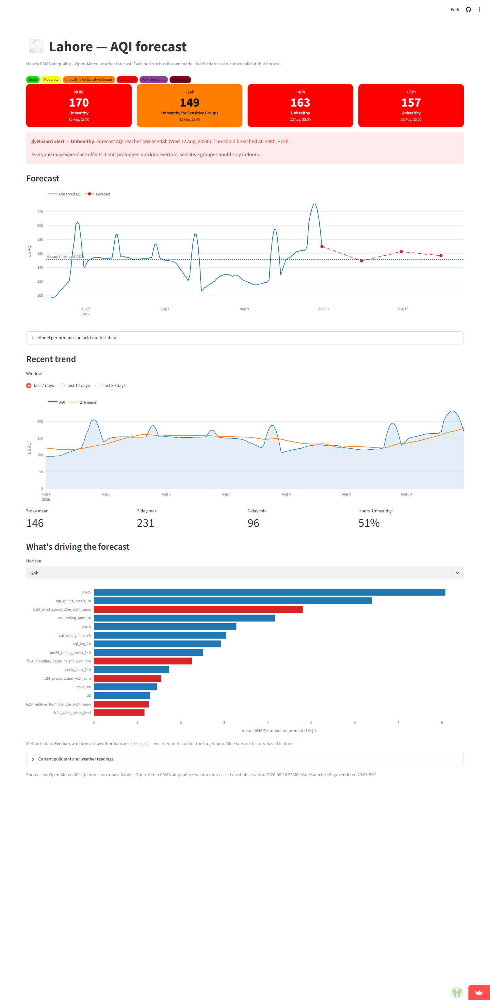

# Lahore AQI Predictor

Serverless end-to-end pipeline forecasting Lahore's Air Quality Index
**24h / 48h / 72h ahead**, with a Hopsworks feature store + model registry,
GitHub Actions scheduling, and a Streamlit dashboard.

### ▶ Live dashboard: https://aqi-predictor-gysxgouemt7ar72ptwcema.streamlit.app



| Horizon | Model | R² | RMSE | MAE | vs best naive baseline |
|---|---|---|---|---|---|
| +24h | XGBoost | **0.833** | 21.75 | 15.81 | +31.1% RMSE |
| +48h | TensorFlow MLP | **0.684** | 29.91 | 22.75 | +23.7% RMSE |
| +72h | TensorFlow MLP | **0.712** | 28.59 | 21.28 | +31.9% RMSE |

Mean R² **0.743** (target > 0.70) · weakest horizon **0.684** (target > 0.60).
Scored on the most recent 20% of ~34.5k hourly rows, split chronologically.

Full write-up: **[REPORT.md](REPORT.md)** · Analysis: **[notebooks/eda.ipynb](notebooks/eda.ipynb)**

## The core idea

Lag features describe where pollution *has been*. What decides where it goes
over the next three days is the weather that is *coming*. So each horizon's
model is fed the **weather forecast valid at that horizon** — the `fc{H}_*`
feature block — not just historical weather.

Measured contribution ([`training_pipeline/ablation.py`](training_pipeline/ablation.py)):

| Horizon | History only | + forecast weather | Δ R² |
|---|---|---|---|
| +24h | 0.767 | 0.820 | +0.053 |
| +48h | 0.526 | 0.665 | +0.140 |
| +72h | 0.444 | 0.654 | **+0.210** |

The gain grows with horizon. **Without it, 48h and 72h fall below the 0.60
floor** — this one design choice is what makes the project pass.

## Architecture

```
Open-Meteo CAMS (AQI) ─┐
                       ├─> features.py ─> Hopsworks Feature Store ─┐
Open-Meteo weather ────┘    (per-horizon    (+ local parquet mirror)│
   archive + FORECAST        fc{H}_* block)                         │
                                                                    v
                                                       training_pipeline/train.py
                                                    (Ridge/RF/LGBM/XGB/TF, daily)
                                                                    │
                                             Hopsworks Model Registry + models/
                                                                    │
                                                                    v
                                                   Streamlit dashboard (webapp/)
```

## Data source note

The project was scaffolded around AQICN, but **AQICN has no live data for
Lahore** — its only station stopped reporting (returns an 18-month-old value),
a bounding-box query returns zero stations, and the geo endpoint silently
substitutes a station in **Delhi, India**. Observations therefore come from
Open-Meteo's CAMS product (no API key, complete hourly history back to
2022-09-01). `aqicn_client.py` is kept as an optional cross-check.
See [REPORT.md §1](REPORT.md) for the verification.

## Setup

There are two requirement sets:

| File | For | Python |
|---|---|---|
| `requirements.txt` | the Streamlit dashboard only — light, no TF/Hopsworks | any 3.9+ |
| `requirements-pipeline.txt` | feature pipeline, training, backfill | **3.9–3.12** |

The split exists so the deployed dashboard isn't forced to install TensorFlow
and the Hopsworks SDK just to draw charts. It loads models from the repo and
live data from keyless APIs; where a Keras model can't be loaded it falls back
to the non-TF model saved alongside it.

The pipeline set needs Python **3.9–3.12**: TensorFlow is pinned to 2.18.1 for
`protobuf` compatibility with `hopsworks`, and that release ships no wheels for
3.13+ — pip reports `No matching distribution found for tensorflow==2.18.1`
without mentioning your interpreter version.

```bash
pip install -r requirements-pipeline.txt   # full stack
cp .env.example .env      # add HOPSWORKS_API_KEY + HOPSWORKS_PROJECT_NAME
```

Only Hopsworks needs credentials — every data source is keyless.

```bash
python feature_pipeline/backfill.py        # ~34.5k rows + data-quality audit
python training_pipeline/train.py          # train, score, register
python training_pipeline/ablation.py       # forecast-weather contribution
streamlit run webapp/app.py                # dashboard
```

### On Windows

The `hopsworks` SDK **cannot be pip-installed on Windows** — it depends on
`pyjks` → `twofish`, which ships source-only and needs MSVC C++ build tools.
Everything still works: `feature_pipeline/store.py` falls back to a local
parquet mirror, so backfill, training and the dashboard all run unchanged. To
populate Hopsworks itself, use the **One-off historical backfill** GitHub
Actions workflow, which runs on Linux.

```bash
python feature_pipeline/backfill.py --local-only
```

## Automation

| Workflow | Schedule | Purpose |
|---|---|---|
| `feature_pipeline.yml` | hourly (:15) | Fetch latest AQ + forecast weather, upsert features |
| `training_pipeline.yml` | daily (03:00 UTC) | Retrain, register best model, commit artifacts |
| `backfill.yml` | manual | One-off seed of the full history |

Repo secrets: `HOPSWORKS_API_KEY`, `HOPSWORKS_PROJECT_NAME`, optionally `AQICN_TOKEN`.

The hourly job re-fetches a **14-day window and upserts** rather than writing a
single row, so a missed run self-heals on the next one instead of leaving a
permanent hole in the lag features.

## Deploying the dashboard (Streamlit Community Cloud)

1. Push this repo to GitHub.
2. Go to https://share.streamlit.io → **New app**, select the repo, branch
   `main`, main file `webapp/app.py`.
3. Add `HOPSWORKS_API_KEY` and `HOPSWORKS_PROJECT_NAME` under **Secrets** to
   serve from the feature store and model registry. Without them the app falls
   back to the live APIs and the models committed in the repo — it still works,
   it just isn't reading the store. The footer states which source is in use.
4. No Python version needs choosing. `requirements.txt` carries no TensorFlow
   and no upper caps on pandas/numpy, so it resolves on whatever interpreter
   Streamlit provisions (currently 3.14). Verified end-to-end on pandas 3.0.5 /
   numpy 2.5.2 / scikit-learn 1.9 with neither TensorFlow nor Hopsworks
   installed: the app runs and serves the non-TF fallback models.

Note that Streamlit Cloud fixes the Python version **when the app is created** —
it cannot be changed afterwards from the settings page. That is why this project
avoids depending on a particular version rather than requiring one.

The daily training workflow commits refreshed models, and Streamlit Cloud
redeploys on push, so the deployed app keeps up to date on its own.

## Project layout

```
config.py                             city, coords, thresholds, feature constants
feature_pipeline/
  openmeteo_aq_client.py              AQI observations (primary source)
  weather_forecast_client.py          weather archive + FORECAST  <- the key fix
  aqicn_client.py                     optional cross-check only
  features.py                         time/lag/rolling/forecast-weather features
  store.py                            Hopsworks + local parquet fallback
  run_feature_pipeline.py             hourly entrypoint
  backfill.py                         historical seed + data-quality audit
  sync_to_hopsworks.py                push local mirror to the feature store
training_pipeline/
  train.py                            Ridge/RF/LightGBM/XGBoost/TF MLP per horizon
  predict.py                          live feature build + serving
  explain.py                          SHAP importance (precomputed at train time)
  ablation.py                         measures the forecast-weather contribution
  register_models.py                  standalone model-registry upload
webapp/app.py                         Streamlit dashboard
notebooks/eda.ipynb                   EDA
```

## Dependency note

`hopsworks` pins `protobuf<5`; TensorFlow ≥2.19 needs `protobuf>=6.31`. Those
ranges don't intersect, so `requirements.txt` pins **`tensorflow==2.18.1`**, the
newest TF that can coexist with the feature store. Re-check this if you bump
TensorFlow.
